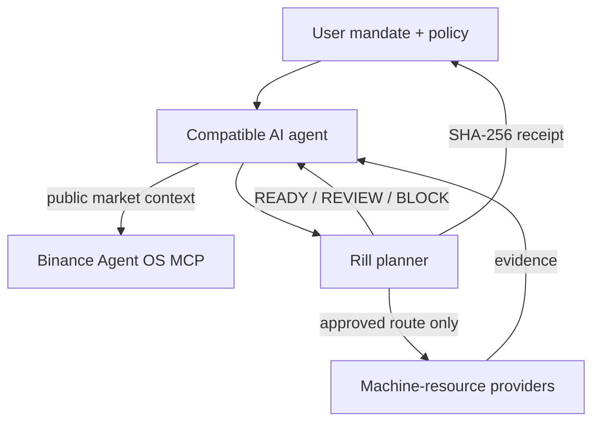

# Rill

**Policy-safe machine-resource procurement for autonomous agents on Binance Agent OS.**

[Live demo](https://rill-agent-payments.ahmardchain.chatgpt.site) · [Agent skill](.agents/skills/rill/SKILL.md) · [Deterministic planner](.agents/skills/rill/scripts/plan-procurement.mjs) · [Design system](UI.md)

An autonomous agent can discover a useful API and still make a bad purchase: duplicate data, an untrusted vendor, an incomplete route, or a spend that quietly crosses policy. Rill sits between the agent and paid machine resources. It evaluates the complete route before authorization, selects the lowest-cost compliant quote for every capability, and emits one deterministic decision receipt.

Rill targets the **Payment Workflows** category. The repository includes a reusable Codex skill, a deterministic policy engine, Binance Agent OS MCP configuration, executable decision fixtures, tests, and an animated interactive explanation of the full flow.

## What is real in this entry

- The planner and its `READY`, `REVIEW`, and `BLOCK` decisions are executable and deterministic.
- The repo-scoped Codex skill is discoverable from `.agents/skills/rill`.
- Binance Agent OS is configured as a remote MCP server for public, read-only market context.
- The interface visualizes x402-style authorization and evidence return.
- No funded account is required for judging, and no simulated authorization is represented as settled funds.

## Decision contract

| Decision | Meaning | Agent action |
| --- | --- | --- |
| `READY` | Every capability has a compliant quote and the route is within the automatic threshold. | The caller may proceed to its separately configured payment rail. |
| `REVIEW` | The route is valid but crosses the human-approval threshold. | Pause and request explicit approval. |
| `BLOCK` | The route is incomplete or violates policy. | Do not authorize; return machine-readable reasons. |

Rill enforces allowed vendors, per-resource caps, total budget, complete capability coverage, valid non-negative prices, and duplicate request fingerprints. The SHA-256 receipt covers the normalized task, policy version, selected route, total, currency, and decision.

## Run the three proof cases

```bash
npm install
npm run demo
npm run demo:review
npm run demo:block
```

The first fixture selects `context.index`, `quant.compute`, and `proof.layer`, returns `READY`, and authorizes **0.68 USDC**. The other fixtures prove that a valid route can be paused for approval and that duplicate paid work is blocked.

## Connect Binance Agent OS MCP in Codex

The repository already carries the project configuration in `.codex/config.toml`. To add the same server to a user-level Codex installation:

```bash
codex mcp add binance --url https://agent.binance.com/mcp/agentic
codex mcp login binance
codex mcp list
```

Open `/mcp` to inspect server status and `/skills` to confirm that Rill is available. This demo uses Binance MCP only for public market context; it does not require trading permissions.

Example agent prompt:

> Use Rill to plan the cheapest policy-safe resource route for a verified BTC volatility brief. Get public market context from Binance Agent OS MCP, do not trade or transfer funds, and return the decision, selected quotes, rejected quotes, reasons, and deterministic receipt.

## Interactive demo

```bash
npm run dev
```

The map tells the workflow spatially: discovery draws the route, comparison reveals quotes, authorization sends amber payment packets, collection returns aqua evidence packets, and completion raises the receipt. The interface supports keyboard navigation, narrow screens, and reduced motion.

## Architecture



## Repository map

- `.agents/skills/rill/` — reusable skill, metadata, and deterministic planner.
- `.codex/config.toml` — Binance Agent OS MCP configuration.
- `examples/rill/` — executable decision fixtures.
- `app/` — animated product interface.
- `tests/` — planner, repository-contract, and UI assertions.
- `DESIGN.md` and `UI.md` — product-specific design rationale and mandatory UI system.
- `SUBMISSION.md` — demo recording and hackathon submission checklist.

## Verify

```bash
npm test
```

Rill governs procurement permission. It does not custody funds, guarantee provider output, or represent an authorization as settlement.

Hackathon: [official announcement](https://www.binance.com/en/blog/community/8802181509900814931) · [entry survey](https://www.binance.com/en/survey/2913aa200aac462c89a737779393f3d4)
